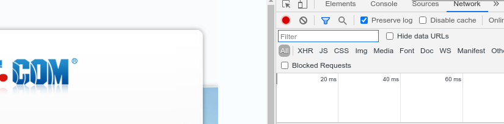
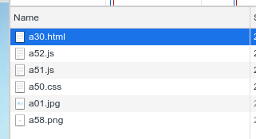
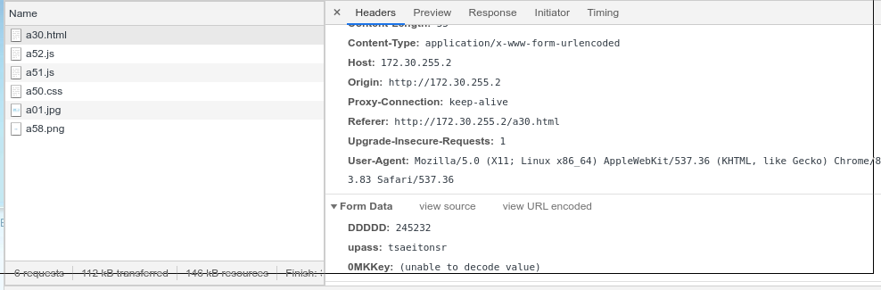
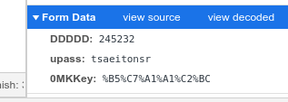

# 使用脚本登录校园网 (curl) & 自动登录
[toc]

## 使用脚本登录校园网 (curl)
你是否会觉得每次连上校园网要打开登录界面很麻烦。
你是否会遇上过新装的Linux还没有图形界面，不能通过浏览器登录上网。
你是否会觉得校园网经常断，重连太麻烦。

那本文就可以帮你解决这些问题。本文实现的条件是你可以通过网页登录。

好在深大宿舍区和教学区都可以通过网页登录。
* 教学区： `https://drcom.szu.edu.cn`
* 宿舍区： `http://172.30.255.2/a30.html`


## 原理
网页登录的原理一般是贴一个POST请求到服务器上。而`curl`这个命令可以把我们的登录信息表单发到服务器上。

```sh
curl -d 'variable=value' URL
```

Windows、Linux、Mac 一般都有curl命令，Windows没有的话可以去这里下 `https://curl.se/windows`

我以深大宿舍区上网为例演示一下:

## 相关信息获取
1. 在浏览器中打开登录网页，并输入帐号密码，不要登录。

2. 打开调试，选择`网络(Network)`， 并勾选`保留日志(Preserve log)`(Firefox 默认保留)

打开调试的方法：

* Chrome, Firefox: F12
* Mac的Safari:
1. Safari浏览器>偏好设置>高级>在菜单栏中显示“开发”菜单
2. 开发>显示JavaScript控制台



3. 点击登录，调试框内会显示新的各种请求接受包



4. 点最上面的`a30.html`，点`标头(Headers)`，这是一个`POST`包，并拉到最下面。



5. 看到输入的帐号密码（别的地方的WIFI可能是被加密过的，但没关系，拷下来就是），但以及一个`0MKKEY`，点击`view URL encoded`，`0MKKEY` 显示出来了



6. 用`curl`登录，在终端（Linux，Mac）cmd（Windows）输入命令，可以在登出后测试。

```sh
curl -d "DDDDD=245235" -d "upass=tsaeitonsr" -d "0MKKey=%B5%C7%A1%A1%C2%BC" http://172.30.255.2/a30.html
# 换上你的帐号密码
```

7. 脚本化
* windows 桌面新建一个`drcom.cmd`，然后把上面这个命令拷进去，下次双击就可以执行啦。
* Linux、Mac 在桌面或者别的地方建一个`drcom.sh`，然后拷贝上面的命令到这个文件里。添加`#!/bin/sh`作为第一行，保存。通过`chmod +x drcom.sh`添加执行权限。
    + Linux 双击或者选择用终端打开就可以了
    + Mac右键选择打开方式>启用：所有应用程序，始终以此方式打开>实用工具>终端

多说一句那一行的意思，在终端执行`./drcom.sh`时，系统会用`/bin/sh`来解释执行，它等同于在终端使用`/bin/sh drcom.sh`，如果你有python程序，在添加`#/bin/python`（自己注意python的位置和版本）后，可以使用`./script.py`来用python执行，当然`./drcom.sh`的前提是文件有执行权限。


## 自动登录
断网了就要重新去点运行脚本好麻烦，那能不能连上校园网断网自动重连呢？

思路是：
* WIFI:
1. 获取当前连着的 WIFI 的名字
2. 如果那个需要登录的WIFI名，包含在当前连着的 WIFI 里（分172和192），就尝试ping baidu.com
3. 如果ping不通，就用curl登录

* 以太网：
1. 比较网关的 mac 地址 (分172和192) 和预存是否一样
2. 如果一样，则尝试ping baidu.com
3. 如果ping不通，就用curl登录

我已经将它写好了，放在原文链接。
* 一般情况把卡号和密码改上，运行一下install就可以了，如果有问题欢迎留言和提issue。
* 需要修改 `drcom.cmd`/`drcom.sh` 里的卡号、密码、以太网的设备名和 mac 地址，保存后然后运行install
* WIFI名称不一定非得是SZU_WLAN, SZU_NewFi，可以加上自己的路由器的WIFI名，这样打开电脑，连上这个WIFI，也会尝试登录的。
* 如果是别的学校的同学可能需要自己修改一下内容啦

需要注意的是：如果你在宿舍跑着这个脚本，就不能在食堂用手机登录啦，会自动踢下线的，但是教学区和宿舍区是分开的（192 和 172 是分开的）。

### Windows
Install 后相关文件：

```
C:\Users\%username%\drcom\drcom_autologin\
C:\Users\%username%\drcom\drcom_autologin\drcom.sh
C:\Users\%username%\drcom\drcom_autologin\drcom.vbs
C:\Users\%username%\AppData\Roaming\Microsoft\Windows\Start Menu\Programs\Startup\drcom.vbs -> C:\Users\%username%\drcom\drcom_autologin\drcom.vbs
```

用`vbs`启动 `cmd`，发送这个`vbs`的快捷方式到开机启动的目录，就可以实现开机自启动了。

### Linux
Install 后相关文件：

```
~/.local/bin/drcom.sh
~/.config/systemd/user/drcom.service
```


通过`systemd`，在用户登录时启动脚本，

但要注意的是 **用户级别的** `systemd`在没登录的时候是不会启动的，我之前把树莓派上的service从系统级别换成用户级别，每次重启后连上树莓派的热点后都要登录，脚本好像失效了，但登录到树莓派上，又能上网了，让我很是困惑。

### Mac
Install 后相关文件：

```
~/.local/bin/drcom.sh
~/Library/LaunchAgents/com.drcom.app.plist
```

### Requirements
* `iproute2mac`

```sh
brew install iproute2mac
```

通过`launchctl`，来实现自动启动脚本。
